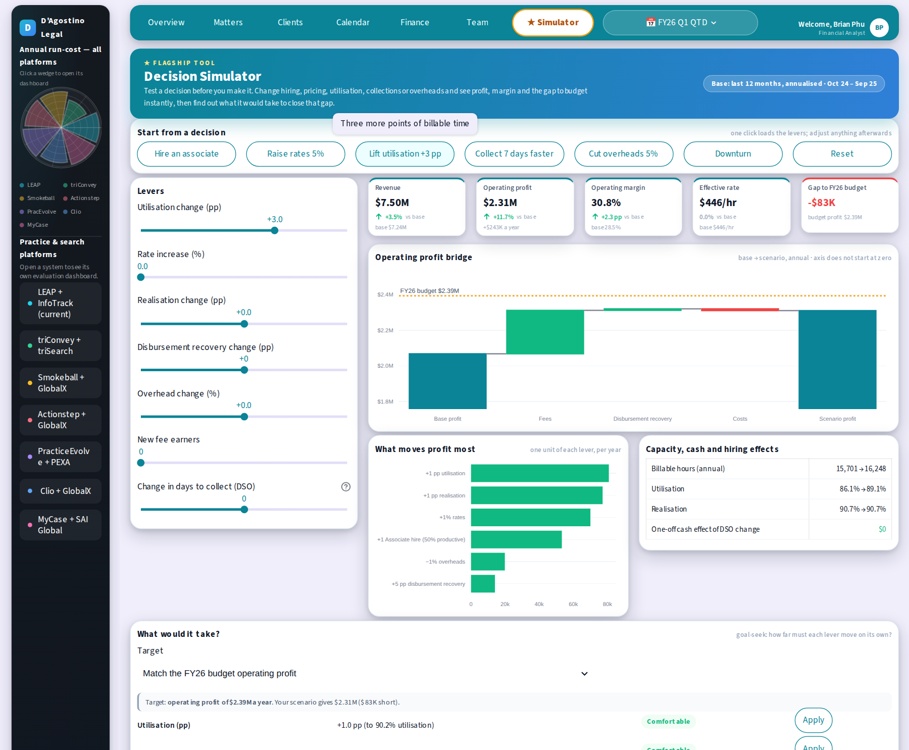
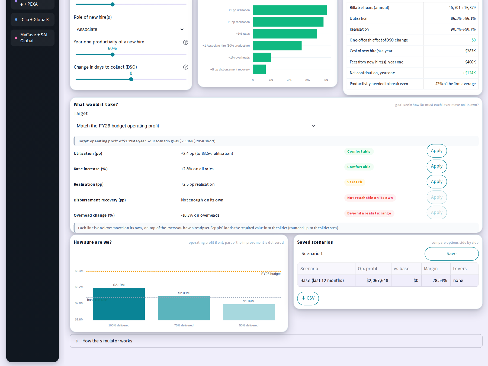
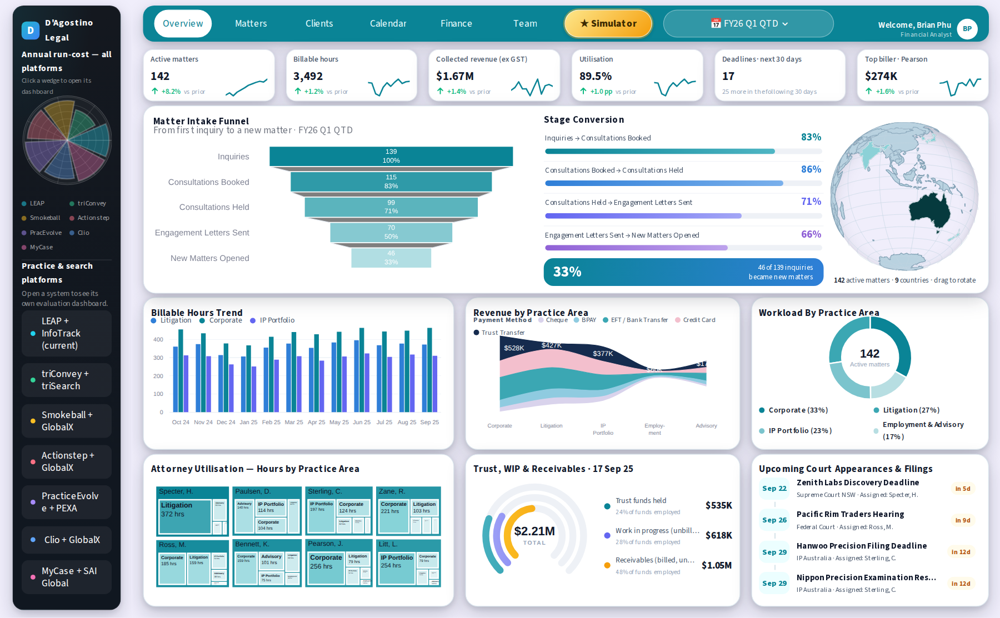
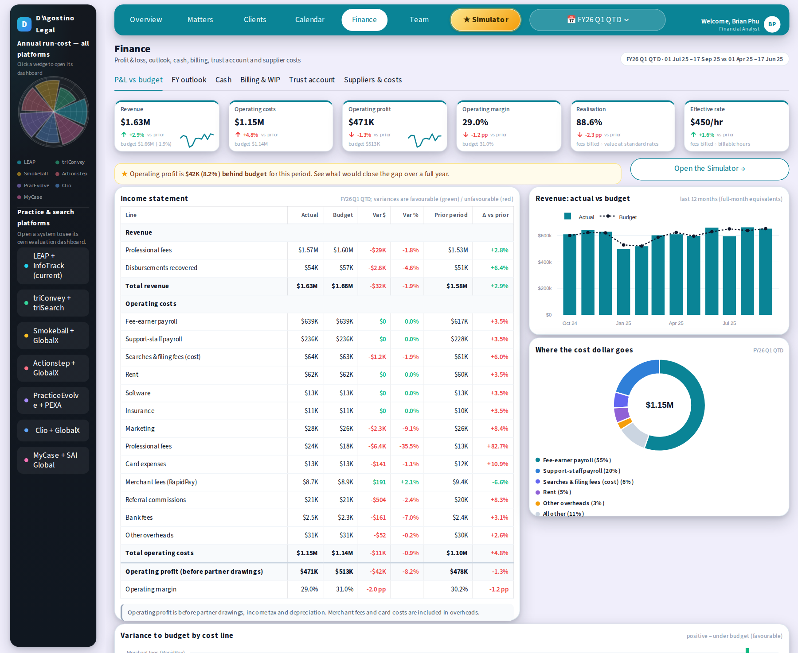
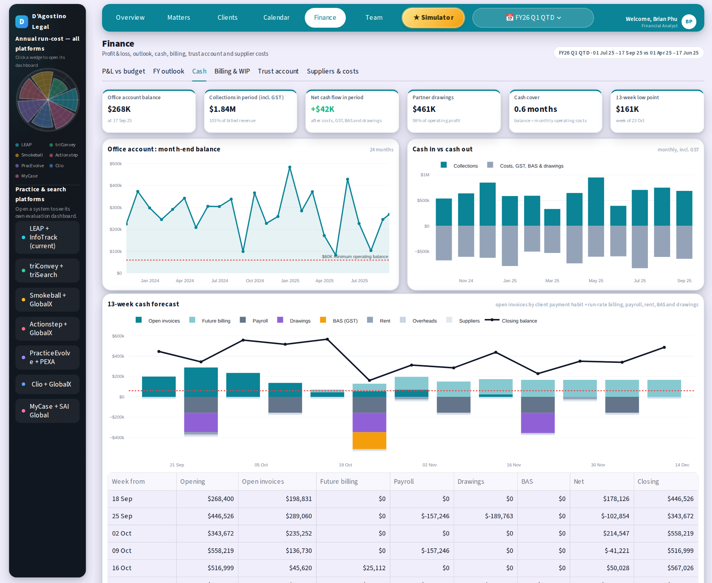
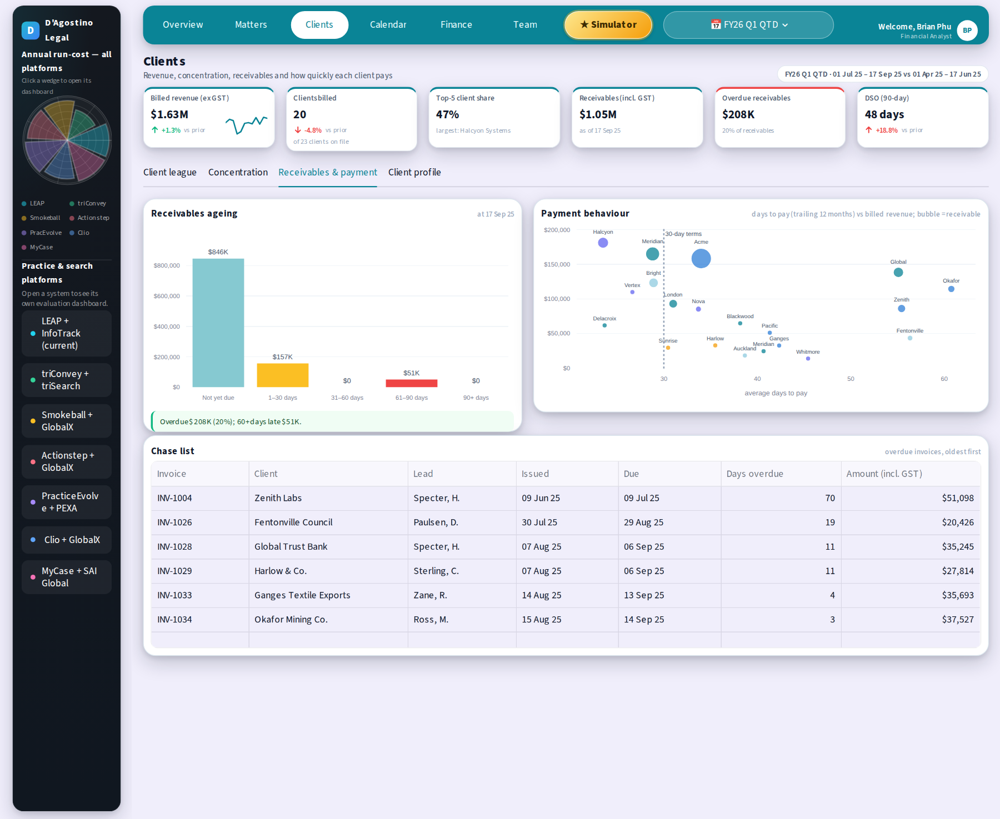
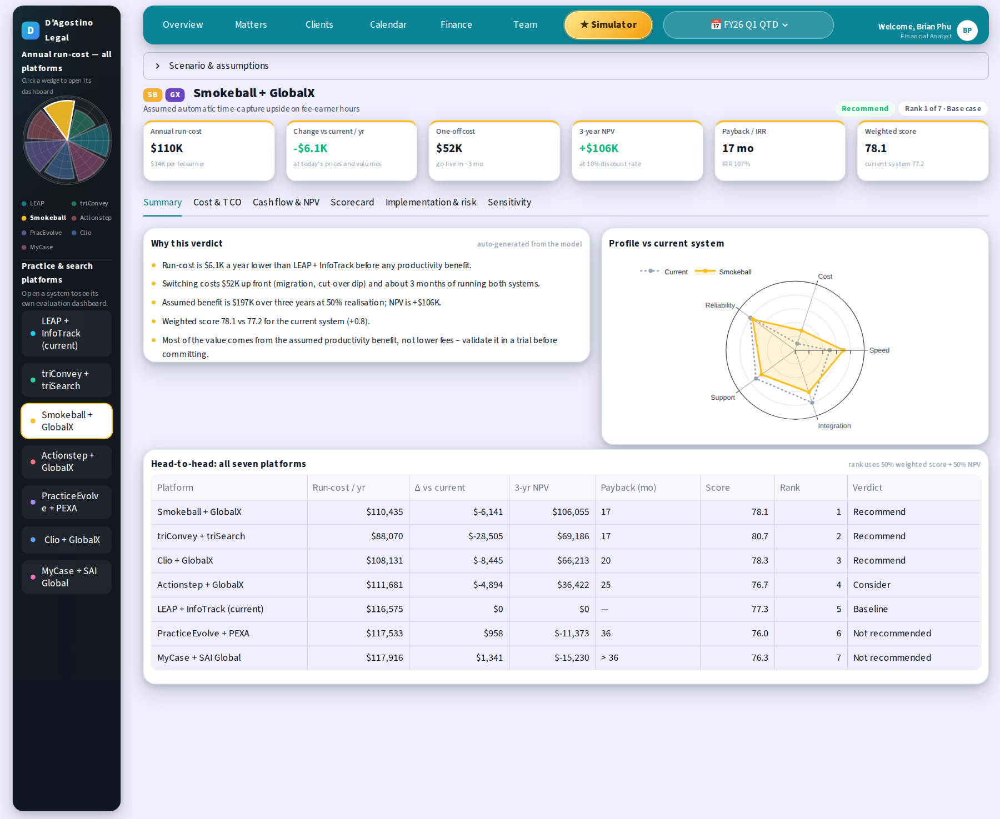
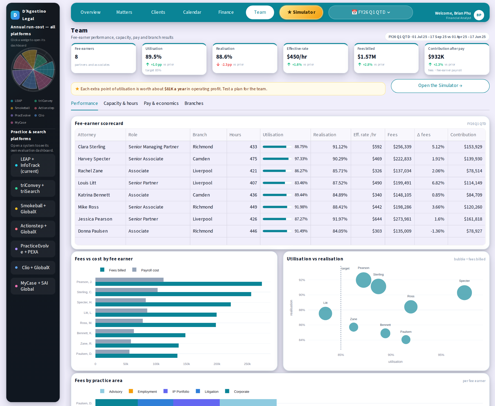

[README-6.md](https://github.com/user-attachments/files/32587714/README-6.md)
# D'Agostino Legal — Financial Operations Dashboard

  

An interactive financial-analysis dashboard for a fictional three-office law firm. Pick a reporting period (month-to-date,
quarter-to-date, financial year or any custom range), compare it with the prior period or the same period last year, and see profit
against budget, working capital, cash outlook and the return on switching practice-management software.

Its centrepiece is the **★ Decision Simulator**: test a business decision *before* making it, see the effect on profit and on the
gap to budget, and work out what it would take to close that gap.



## ★ Flagship: the Decision Simulator

A Financial Analyst's most useful question is not "what happened?" but **"what should we do about it?"** The Simulator answers that on the
last 12 months of actuals:

* **One-click decisions.** Hire an associate, raise rates, lift utilisation, collect faster, cut overheads or model a downturn, then adjust any lever.
* **Gap to budget, always visible.** Every change is shown against the FY26 budget operating profit ($2.39M) on a live bridge chart.
* **"What would it take?" (goal-seek).** Pick a target (match budget profit, reach the budget margin, or add a custom uplift) and see how far each lever
  must move on its own. On the sample data, closing the $326K gap needs about **+4.0 pp utilisation**,
  or **+4.7% rates**, or **+4.2 pp realisation**. One click applies the answer to the sliders.
* **"How sure are we?"** Shows the result if only 100% / 75% / 50% of the planned improvement is delivered. Setbacks are never softened.
* **Real hiring economics.** A new associate must be about **42% as productive as the firm average** in year one just to cover their own cost,
  and the chart shows what happens if the ramp-up disappoints.
* **Saved scenarios** to compare options side by side, with CSV export.
* **Joined up with the analysis.** The Finance, billing and Team pages link straight into the Simulator with the right goal or decision pre-loaded, and your levers are kept as you move around the app.



**Example decisions on the sample data** (base: last 12 months, $2.07M operating profit a year, 28.5% margin; FY26 budget $2.39M):

| Decision | Profit change a year | Margin | Gap to FY26 budget | If only 50% is delivered |
|---|---|---|---|---|
| Raise rates 5% | +$350K | 31.8% | +$24K | +$175K |
| Lift utilisation +3 pp | +$243K | 30.8% | -$83K | +$121K |
| Cut overheads 5% | +$99K | 29.9% | -$226K | +$50K |
| Hire an associate (60% productive in year one) | +$120K | 28.5% | -$205K | -$81K |
| Collect 7 days faster | $0 (releases about $153K of cash once) | 28.5% | -$326K | $0 |
| Downturn: −5 pp utilisation, +3% overheads | -$464K | 23.5% | -$790K | -$464K |

Method, formulas and limits: [docs/SIMULATOR.md](docs/SIMULATOR.md).

## In one minute

A small law firm's partners ask the same questions every month. This project answers them in one place, and shows the working behind every number:

| The question | Where to look |
|---|---|
| **What should we do about it? What if we hire, raise rates or collect faster?** | **★ Simulator** (levers, gap to budget, goal-seek, delivery risk, saved scenarios) |
| Are we ahead or behind budget, and why? | **Finance → P&L vs budget** (line-by-line variances, favourable / unfavourable) |
| Where will the year land? | **Finance → FY outlook** (year-to-date actuals plus the remaining budget scaled to current performance) |
| Will we run short of cash in the next quarter? | **Finance → Cash** (13-week forecast from client payment habits, payroll, rent, GST and drawings) |
| Who owes us money, and who pays late? | **Clients → Receivables & payment** (ageing, days-to-pay by client, chase list) |
| Are our lawyers busy and profitable? | **Team** (utilisation, realisation, effective rate, contribution after pay, branch results) |
| Should we change our practice-management system? | **Seven platform dashboards** (3-year cost, NPV, payback, weighted scorecard, risks, sensitivity) |



## Example findings (from the synthetic data)

These come straight from the model, so they match what you see when you run it (quarter-to-date, 1 Jul – 17 Sep 2025):

* **Profit is behind budget even though revenue is growing.** Revenue is $1.63M: 2.9% above the prior period but 1.9% below budget.
  Operating margin is 29.0% against a 31.0% budget, because costs grew 4.8% against revenue's 2.9%.
* **Working capital needs attention.** DSO is 48 days; $208K (20%) of receivables is overdue and $51K of that is more than 60 days late.
* **The full-year forecast sits below budget.** At current performance FY26 operating profit lands near $2.20M against a $2.39M budget (−8.2%).
* **A cash pinch is visible in late October.** The 13-week forecast dips to about $161K in the week of 23 Oct, when payroll, partner
  drawings and the quarterly GST payment fall together.
* **Platform switch:** Smokeball has the best 3-year NPV (+$106K) but only if at least ~19% of its assumed productivity benefit is realised;
  triConvey has the lowest run-cost ($88K a year against $117K today); PracticeEvolve and MyCase have negative NPV on the base assumptions.
* **What the Simulator says about it:** each extra point of utilisation is worth about $81K a year, so a 3-point improvement recovers roughly three quarters of the gap to budget.

## More screenshots

| | |
|---|---|
|  **P&L vs budget** (with a link into the Simulator) |  **Cash and 13-week forecast** |
|  **Receivables and payment behaviour** |  **Platform evaluation (one per platform)** |
|  **Team performance** | |

## What this project demonstrates

**Financial analysis**
* Decision analysis: scenario modelling, goal-seek ("what would it take?"), delivery-risk haircuts, break-even productivity for a hire, scenario comparison.
* Management reporting: income statement with actual vs budget vs prior period, favourable/unfavourable variance logic.
* Legal-industry KPIs: utilisation, realisation, effective rate, WIP, lock-up days, DSO, matter ageing.
* Working capital and cash: receivables ageing, expected-collection modelling, a 13-week cash forecast, GST/BAS timing.
* Trust-account awareness: client trust money is kept separate from firm revenue and cash, with per-client ledgers.
* Investment appraisal: 3-year TCO, NPV, IRR, payback, scenarios (base / downside / upside), sensitivity and break-even analysis.
* Reporting periods done properly: month-to-date, quarter-to-date, Australian financial year (1 Jul – 30 Jun), custom ranges.

**Engineering**
* Python, pandas, NumPy, Plotly and Streamlit; about 4,400 lines organised into a model layer, a metrics layer, a simulation engine and page modules.
* One deterministic financial model as the single source of truth, so every page reconciles to every other page.
* **75 automated tests:** reconciliation checks (for example, the invoice ledger equals modelled revenue to the dollar, branch and attorney tables sum to firm totals),
  simulator maths (goal-seek answers land exactly on the target), and browser-style tests that click buttons and edit controls, including regression tests for past bugs.
* Continuous integration on GitHub Actions.

Method notes: [docs/METHODOLOGY.md](docs/METHODOLOGY.md) (every KPI and model formula) · [docs/SIMULATOR.md](docs/SIMULATOR.md) (the Simulator) · [docs/ARCHITECTURE.md](docs/ARCHITECTURE.md) (how the code fits together).

## Run it locally

```bash
git clone <repository-url>          # the green "Code" button on this page gives you the URL
cd dagostino-legal-fa-dashboard
python -m venv .venv && source .venv/bin/activate      # Windows: .venv\Scripts\activate
pip install -r requirements.txt
streamlit run app.py
```

Tested with Python 3.12, Streamlit 1.64, pandas 3.0, NumPy 2.4–2.5 and Plotly 7.1. Best viewed in a browser window at least 1280 px wide.
The model builds in about two seconds and is cached. The globe on the Overview page loads its map from Plotly's CDN, so it needs an internet connection.

**Tests:** `pip install -r requirements-dev.txt && python -m pytest -q`

## Deploy your own copy (free)

1. Push the repository to your GitHub account.
2. Go to [share.streamlit.io](https://share.streamlit.io), sign in with GitHub and choose **New app**.
3. Select the repository, branch `main`, main file `app.py`; under *Advanced settings* choose Python 3.12.
4. Optionally add the resulting URL to the top of this README as a live-demo link.

## Data, assumptions and disclaimers

* **All data is synthetic.** The firm, its clients, matters and staff are fictional. A fixed random seed makes the data
  reproducible, and the model is calibrated so headline balances on the as-of date (17 Sep 2025) are exact:
  142 active matters, office cash $268,400, trust funds $535,000.
* **Simulator results are decision aids, not forecasts.** They hold volumes, mix and client behaviour constant except for the levers you change, and assume enough work exists for any new hire.
* **Platform figures are illustrative.** Prices, scores, migration costs and productivity uplifts for the seven platforms are
  assumptions for demonstrating the method. They are not vendor quotes or facts, and the analysis should be re-run with
  real quotes before it informs a decision.
* Product names such as LEAP, InfoTrack, Smokeball, Actionstep, Clio and MyCase belong to their owners. This project is not
  affiliated with or endorsed by any of them.
* Some modelling shortcuts are deliberate and visible in the app: fixed costs (payroll, rent, software, insurance) equal budget
  exactly, and cash cover looks short because partners draw most of each month's profit.
* Operating profit is shown before partner drawings, income tax and depreciation.

## Development notes

This project was developed iteratively with AI assistance (Anthropic's Claude) working from the author's requirements and
feedback on screenshots. The financial definitions are documented in [docs/METHODOLOGY.md](docs/METHODOLOGY.md) and are
covered by the automated tests, so they can be checked and challenged independently of how the code was written.

## Author

Built by Brian Phu, Financial Analyst. Licensed under the [MIT License](LICENSE).
