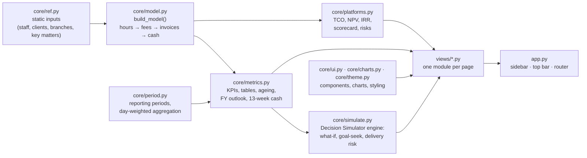

# Architecture

The app is a thin Streamlit layer over a deterministic financial model. Data flows one way:

## Layers

| Layer | Files | Responsibility |
|---|---|---|
| Inputs | `core/ref.py` | Fixed reference data. Change staff, clients, branches or the as-of date here. |
| Model | `core/model.py` | Builds every monthly series, the invoice ledger, matter ledger, trust ledger and detail tables. Deterministic (fixed seed). |
| Periods | `core/period.py` | Presets, comparison windows, the day-weighted aggregation that makes any date range reconcile, and the period-picker widget. |
| Metrics | `core/metrics.py` | Pure functions from (model, period) to KPIs and tables. No Streamlit calls. |
| Evaluation | `core/platforms.py` | Platform cash flows, NPV/IRR/payback, scoring, sensitivity, risk register. Pure functions. |
| Simulation | `core/simulate.py` | The Decision Simulator's engine: annual what-if, goal-seek, delivery-risk range, lever ranking. Pure functions, unit-tested. |
| Presentation | `core/ui.py`, `core/charts.py`, `core/theme.py` | Formatters, KPI cards, reusable charts, CSS. |
| Pages | `views/` | One module per page; `platform_view.py` serves all seven platforms. |
| Entry point | `app.py` | Builds the model once (cached), draws the sidebar and top bar, and routes to a page. |

## Design decisions

* **One source of truth.** Pages never compute their own versions of a number; they ask `metrics.py`, which reads the model. That is
  why the tests can assert that, for example, the branch table sums to the firm P&L.
* **Full-month equivalents plus day weighting** rather than storing daily data: compact, fast, and exact for any date range.
* **Pure functions for analysis.** `metrics.py` and `platforms.py` take data in and return data out, which makes them easy to test
  without a browser.
* **Model cached with `st.cache_resource`.** It builds in about two seconds on first load.
* **Session state** holds the selected page, platform and reporting period. Streamlit forgets a widget's value when its page is not drawn, so the Simulator's levers and the
  scorecard weights are saved and restored (`ui.restore_state` / `ui.keep_state`) and the levers survive navigation.
* **Callbacks for buttons that change widgets.** Presets, Reset and Apply use `on_click` callbacks, the only safe way to change a slider's value after it has been drawn.

## Extending it

* **Real data:** replace `build_model()` with a loader that returns the same structures (monthly frames `fin`, `plan`, `stock`; ledgers `inv`,
  `matters`, `trust_txns`; the detail tables; see the top of `core/model.py`). Pages read only from this dictionary, but expect to adapt
  column names and to check every page.
* **A new page:** add `views/<name>.py` with `render(M, cur, cmp)` and register it in `PAGES` and `NAV_ITEMS`.
* **A new platform:** add an entry to `PLATFORMS` in `core/platforms.py` and a colour to `PLATFORM_COLOR_LIST` in `core/theme.py`; the polar chart,
  ranking and dashboard pick it up.
