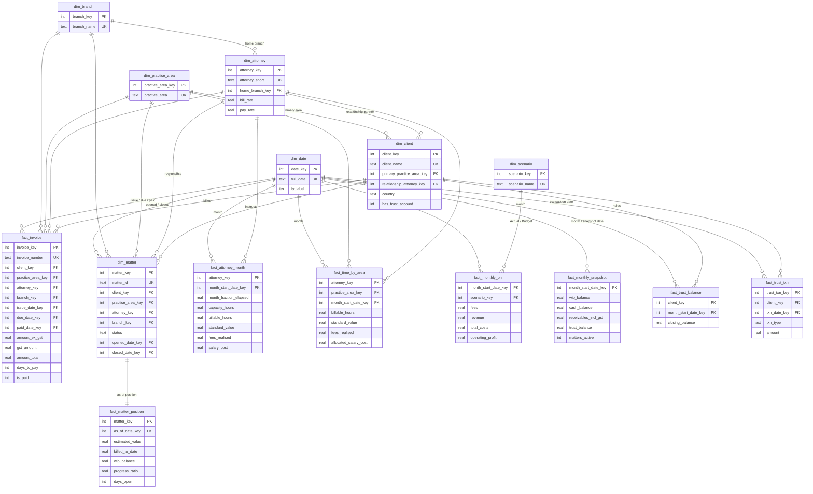
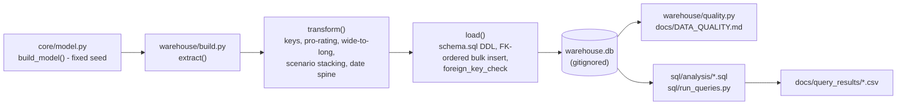

# Data model

A Kimball-style star schema in SQLite (`warehouse.db`, built by `python -m warehouse.build`, gitignored). It is loaded from the
**simulated** dataset in `core/model.py` (fixed seed): a fictional firm, clients, matters and invoices. DDL:
[`warehouse/schema.sql`](../warehouse/schema.sql). Column-level detail and the source-to-target mapping:
[DATA_DICTIONARY.md](DATA_DICTIONARY.md).

(Keys and principal attributes only; every column is listed in the data dictionary.)

## Grain

| Table | Type | Grain (one row per...) | Business key | Surrogate / primary key |
|---|---|---|---|---|
| `fact_invoice` | Transaction fact | invoice | `invoice_number` | `invoice_key` |
| `fact_matter_position` | Periodic snapshot fact | matter, as at the as-of date | `matter_id` | `matter_key` |
| `fact_attorney_month` | Periodic snapshot / accumulating-style fact | attorney per active month | attorney + month | (`attorney_key`, `month_start_date_key`) |
| `fact_time_by_area` | Fact | attorney x practice area x active month | attorney + area + month | composite PK |
| `fact_monthly_pnl` | Periodic snapshot fact | month x scenario (Actual / Budget) | month + scenario | composite PK |
| `fact_monthly_snapshot` | Periodic snapshot fact | month (stock balances at month end / as-of date) | month | `month_start_date_key` |
| `fact_trust_balance` | Periodic snapshot fact | client trust ledger x month | client + month | composite PK |
| `fact_trust_txn` | Transaction fact | trust deposit or disbursement | none in source | `trust_txn_key` |
| `dim_matter` | Dimension | matter | `matter_id` (names are NOT unique) | `matter_key` |
| `dim_client` | Dimension | client | `client_name` | `client_key` |
| `dim_attorney` | Dimension | fee earner | `attorney_short` | `attorney_key` |
| `dim_branch`, `dim_practice_area`, `dim_scenario` | Dimensions | office / practice area / scenario | name | integer key |
| `dim_date` | Date dimension | calendar day, contiguous, with Australian financial-year attributes | `full_date` | `date_key` = yyyymmdd |

## Design decisions

* **Pro-rated flows.** Flow measures for the month containing the as-of date are stored as observed-to-date (`x month_fraction_elapsed`), so SUMs reconcile to the app. Stocks are point-in-time. Ratios (utilisation, realisation) are unaffected.
* **Additivity.** Hours, values, fees and costs are additive across attorneys, areas and months. Snapshot stocks (`wip_balance`, `trust_balance`, `matters_active`, `receivables_incl_gst`) are semi-additive: never sum them across months. `month_fraction_elapsed`, ratios and `progress_ratio` are non-additive.
* **Scenario dimension.** Actual and Budget share one fact table keyed by `scenario_key`, so variance is a pivot in SQL rather than a join across two tables.
* **Allocated cost is derived.** `allocated_salary_cost` splits salary by hours share. It supports practice-area contribution analysis; overheads are deliberately not allocated.
* **Role-playing dates.** `dim_date` is joined as issue, due, paid, opened, closed and snapshot dates; the role is in the key column name.
* **Nullable keys instead of sentinel rows** for dates that genuinely do not exist yet (unpaid invoice, open matter); the quality suite checks NULL occurs if and only if the lifecycle state says so.
* **Type-1 dimensions.** The simulator holds one current row per entity, so changes over time (rate rises, matter reassignment) are not tracked. A real implementation would use type-2 rows for rates and matter ownership.
* **Integrity.** Foreign keys are enforced at load and verified with `PRAGMA foreign_key_check`; CHECK constraints guard flags, status, amounts and ratios; indexes cover fact foreign keys and the date columns used in the queries.
* **Lineage / audit.** `etl_meta` records the origin (SIMULATED), seed, as-of date and currency; `etl_load_audit` records the row count loaded into each table.

## Pipeline

